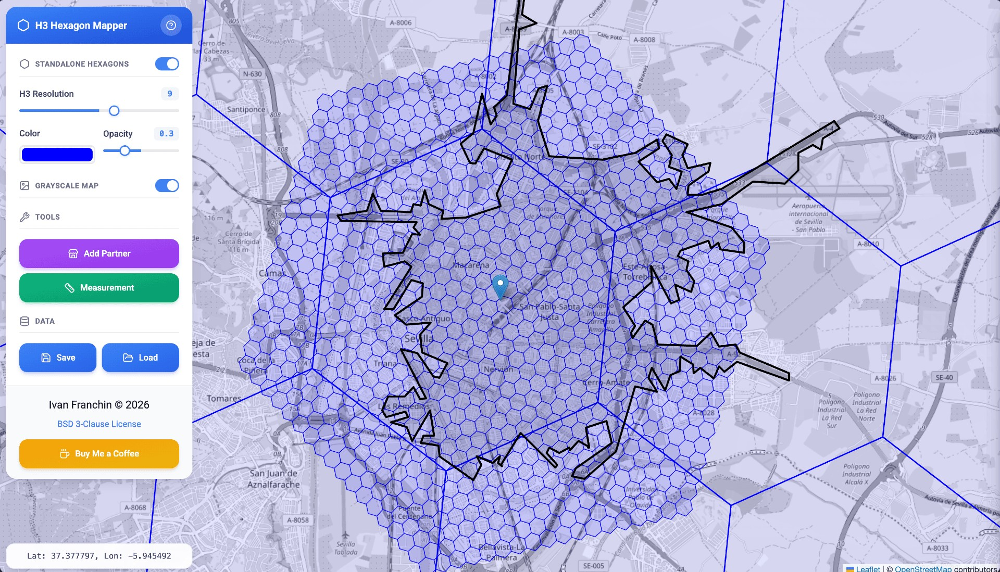

# H3 Hexagon Mapper

[](https://ivangfr.github.io/h3-hexagon-mapper)
[](LICENSE)
[](https://buymeacoffee.com/ivan.franchin)

A web tool for viewing and interacting with H3 hexagons on a map. Add or remove hexagons, adjust size, color, and transparency, manage partners with their own zones, draw delivery area polygons, highlight intersecting hexagons, measure distances, use a right-click context menu for location info, and save or load data as JSON files.



## Online Tool

[https://ivangfr.github.io/h3-hexagon-mapper](https://ivangfr.github.io/h3-hexagon-mapper)

## Libraries Used

- [Leaflet](https://github.com/Leaflet/Leaflet): A JavaScript library for interactive maps. License: [BSD 2-Clause "Simplified" License](https://github.com/Leaflet/Leaflet/blob/main/LICENSE)
- [H3-js](https://github.com/uber/h3-js): A JavaScript library for working with H3 hexagons. License: [Apache License 2.0](https://github.com/uber/h3-js/blob/master/LICENSE)
- [Turf.js](https://github.com/Turfjs/turf): A modular geospatial analysis library for JavaScript. License: [MIT License](https://github.com/Turfjs/turf/blob/master/LICENSE)
- [OpenStreetMap](https://www.openstreetmap.org/): Used for map tiles. License: [Open Data Commons Open Database License (ODbL)](https://www.openstreetmap.org/copyright)
- [Tailwind CSS](https://tailwindcss.com/): A utility-first CSS framework for rapid UI development. License: [MIT License](https://github.com/tailwindlabs/tailwindcss/blob/master/LICENSE)
- [Lucide Icons](https://lucide.dev/): A beautiful & consistent icon toolkit. License: [ISC License](https://github.com/lucide-icons/lucide/blob/main/LICENSE)

## How to Use it

### Standalone Hexagons

Standalone hexagons are individual hexagons you can add anywhere on the map. You can enable or disable this feature using the toggle in the controls panel.

- **Enable/Disable**: Use the "Standalone Hexagons" toggle to enable or disable the ability to add hexagons on the map. When disabled, the hexagon settings are hidden.
- **Add a Hexagon**: Click on the map to add a hexagon at the clicked location.
- **Remove a Hexagon**: Click on an existing hexagon to remove it. Make sure the resolution of the hexagon is the same as the resolution slider value.
- **Adjust Resolution**: Use the resolution slider to adjust the H3 resolution of the hexagons (0-15).
- **Change Color**: Use the color picker to change the color of the hexagons.
- **Change Opacity**: Use the opacity slider to change the opacity of the hexagons.

### Map Display

- **Grayscale Map Toggle**: Use the "Grayscale Map" toggle to switch the map tiles between normal color and grayscale view.
- **Cursor Coordinates**: As you move your mouse over the map, the coordinates are displayed in real-time at the bottom-left corner of the screen.

### Tools

#### Add Partner

- **Open Form**: Click the "Add Partner" button in the Tools section to open the partner form with empty coordinates.
- **Enter Location**: Manually provide the latitude and longitude for the partner location.

#### Measurement Mode

- **Activate**: Click the "Measurement" button to enable measurement mode. An overlay will appear, controls will be dimmed and disabled, and a "Measurement Mode" indicator bar will show at the top of the screen with a pulsing "Stop" button.
- **First Click**: Sets the starting point. A black circle marker appears at the start location, and a dashed line follows your cursor as you move the mouse.
- **Second Click**: Completes the measurement. An end marker appears, the dashed line stays visible, and the final distance is displayed.
- **Third Click**: Clears the measurement (line and markers) and starts fresh with a new starting point.
- **Line Color**: Use the color picker in the indicator bar to customize the measurement line color.
- **Exit**: Click the "Stop" button in the top indicator bar, or press the `Esc` key to exit measurement mode.

### Right-Click Context Menu

- **Open Context Menu**: Right-click anywhere on the map to open a context menu at that location.
- **Add Partner Here**: Click "Add Partner Here" to open the partner form pre-filled with the clicked coordinates. A cross marker shows the selected position.
- **Customer Info Here**: Click "Customer Info Here" to view detailed information about hexagons and partners at the clicked location.

### Partner Management

Partners allow you to add and manage H3 hexagonal zones around specific locations.

#### Add Partner

There are two ways to add a partner:

1. **Tools Button**: Click "Add Partner" in the Tools section to open the partner form with empty coordinates. Manually enter the latitude and longitude.
2. **Context Menu**: Right-click on the map and click "Add Partner Here" to open the partner form pre-filled with the clicked coordinates.

#### Edit Partner

Click on a partner marker on the map to open the partner info panel, then click "Edit Partner" to modify the partner's settings.

#### Delete Partner

Click on a partner marker and use the "Delete Partner" button to remove it from the map.

#### Partner Form

When adding or editing a partner, you can configure:

- **Partner ID**: Unique identifier for the partner.
- **Coordinates**: Latitude and longitude of the partner location.
- **Primary Zone**: H3 resolution (0-15), number of zones (1-50), and color.
- **Secondary Zone**: Optional additional zone layer with its own resolution, number of zones, and color. Enable the toggle to configure.
- **Delivery Area**: Optional custom delivery polygon. Enable to define a boundary.
  - **Draw Delivery Area**: Click the "Draw Delivery Area" button to interactively draw a polygon on the map:
    - **Add Points**: Click on the map to add polygon vertices (minimum 3 points required).
    - **Close Polygon**: Click near the start point (turns green when close) to complete the polygon.
    - **Multi-Polygon**: After closing a polygon, you can immediately start drawing another one. All polygons will be combined when saved.
    - **Export**: Choose "WKT" or "KML" to export the polygon(s) to the form.
      - **Separate polygons**: Exported as `MULTIPOLYGON` in WKT or multiple `<Placemark>` elements in KML.
      - **Nested polygons**: A polygon drawn inside another becomes a hole (inner ring) in a single `POLYGON` or `<Polygon>` with `<innerBoundaryIs>`.
    - **Cancel**: Click Cancel to exit drawing mode without saving.
    - **Undo Point**: Press `Esc` to remove the last point while drawing.
    - **Undo Polygon**: Press `Esc` to remove the last completed polygon (with confirmation). If no polygons exist, cancels the mode.
  - **Or Paste Content**: Manually paste KML or WKT content in the textarea.
  - **Supported Formats**:
    - **KML**: XML-based format with coordinates tags.
    - **WKT**: Single polygon with coordinate pairs or multiple polygons for complex areas.
  - **Color**: Choose a custom color for the delivery area polygon, or use the same color as the primary zone.

### Customer Info

The Customer Info sidebar provides detailed information about hexagons and partners at a specific location.

- **Open**: Right-click on the map and select "Customer Info Here" from the context menu.
- **Coordinates**: Displays the latitude and longitude of the clicked location.
- **Summary**: Shows the total hexagon count and partner count at the location.
- **Partners Arriving at Location**: Lists partners whose hexagons cover this location.
  - If a partner has a delivery area defined, only hexagons intersected by that delivery area are included (partners only "arrive" at locations within their delivery zone).
  - Shows partner ID, delivery area status, zone type (primary/secondary), zone number, and H3 index.
- **Hexagons at Location**: Shows all H3 hexagons at the clicked location.
  - Displays H3 index, resolution, and associated partner (if any).
  - Includes both standalone hexagons and partner hexagons.
  - Hexagons are sorted by resolution (highest first).

### Partner Info

When viewing a partner's info panel:

- **Primary Zone Toggle**: Show/hide the primary H3 hexagonal zones for the selected partner.
- **Secondary Zone Toggle**: Show/hide the secondary H3 hexagonal zones for the selected partner (if configured).
- **Delivery Area Toggle**: Show/hide the delivery area polygon for the selected partner (if configured).
- **Highlight Intersection Toggle**: When a delivery area is defined, highlight hexagons that intersect with the delivery polygon. This toggle is enabled only when the delivery area and at least one zone (primary or secondary) are visible.
- **Limit Delivery to Primary Toggle**: When enabled (default), if the delivery area is entirely inside the primary zone, secondary zone hexagons are marked as NOT intersected. This prevents double-counting. This toggle is only visible when both delivery area AND secondary zone exist.
- **Partner Statistics**: View the resolution, number of zones, hexagon count, and intersection count (when delivery area exists) for both primary and secondary zones.
  - **Coverage Bar**: When a delivery area exists, a visual progress bar shows the percentage of hexagons that intersect with the delivery area.

### Data Management

- **Save**: Click the "Save" button to download both hexagons and partners as a JSON file.
- **Load**: Click the "Load" button and select a JSON file to load hexagons and partners.

## How to Run Locally

To run the project locally, follow these steps:

1. Clone the repository:
    ```sh
    git clone https://github.com/ivangfr/h3-hexagon-mapper.git
    ```
2. Navigate to the project directory:
    ```sh
    cd h3-hexagon-mapper
    ```
3. Open the `index.html` file in your web browser:
    ```sh
    open index.html
    ```

## Contributing

Contributions are welcome! If you have any ideas, suggestions, or bug reports, please open an issue or submit a pull request.

## Support

If you find this useful, consider buying me a coffee:

<a href="https://buymeacoffee.com/ivan.franchin"></a>

## License

This project is licensed under the [BSD 3-Clause License](./LICENSE).
